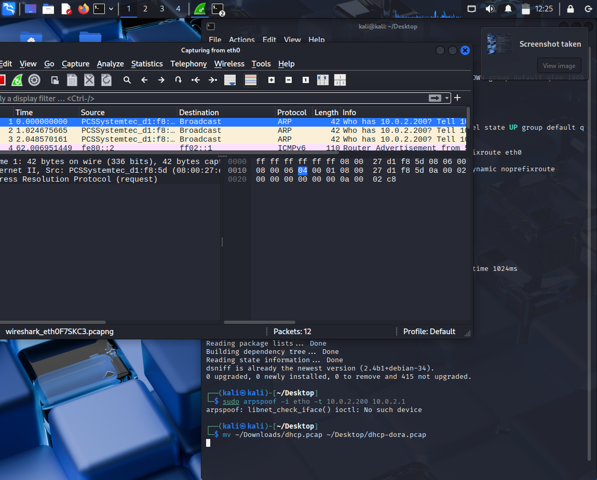
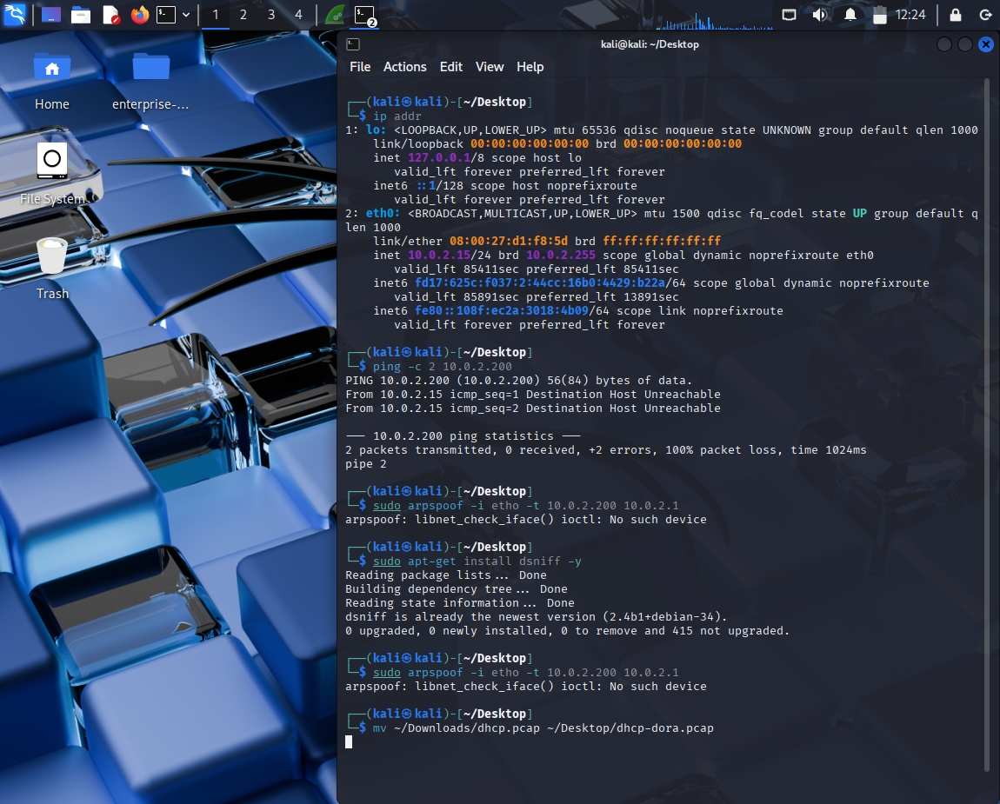

# Day 2 🌱: IP vs MAC, ARP Traffic & Spoofing Detection

## 🔹 Objective
Understand ARP (Address Resolution Protocol) traffic, compare IP vs MAC, and simulate spoofing to learn how detection works.

---

## 🔹 Lab Steps
1. Identified network interface & IP  
   ```bash
   ip addr
Interface: eth0

Local IP: 10.0.2.15

Gateway: 10.0.2.1

Selected a fake IP for testing
  ->ping -c 2 10.0.2.200
 → No response (unused, safe for spoofing)

# Installed and ran ARP spoof

sudo apt-get install dsniff -y
sudo arpspoof -i eth0 -t 10.0.2.200 10.0.2.1

# Captured ARP traffic in Wireshark with filter:

arp

#Observations

Normal ARP: "Who has 10.0.2.200? Tell 10.0.2.15"

Spoofing Simulation: Sent fake ARP replies pretending gateway = attacker’s MAC.

Detection clue: Multiple MAC addresses claiming to be same IP = ARP cache poisoning.


# 🔹 Screenshots

### Wireshark Capture


### Steps for ARP Spoofing



#🔹 Real-World Mapping

->MITRE ATT&CK

->Tactic: Credential Access / Collection

->Technique: T1557 – Adversary-in-the-Middle

->Sub-technique: T1557.002 – ARP Cache Poisoning

#🔹 Learning Outcome

ARP is the link between IP (Layer 3) and MAC (Layer 2). Attackers exploit this with spoofing to perform Man-in-the-Middle attacks. Wireshark/SIEM detection relies on identifying duplicate MAC entries or abnormal ARP reply behavior.
