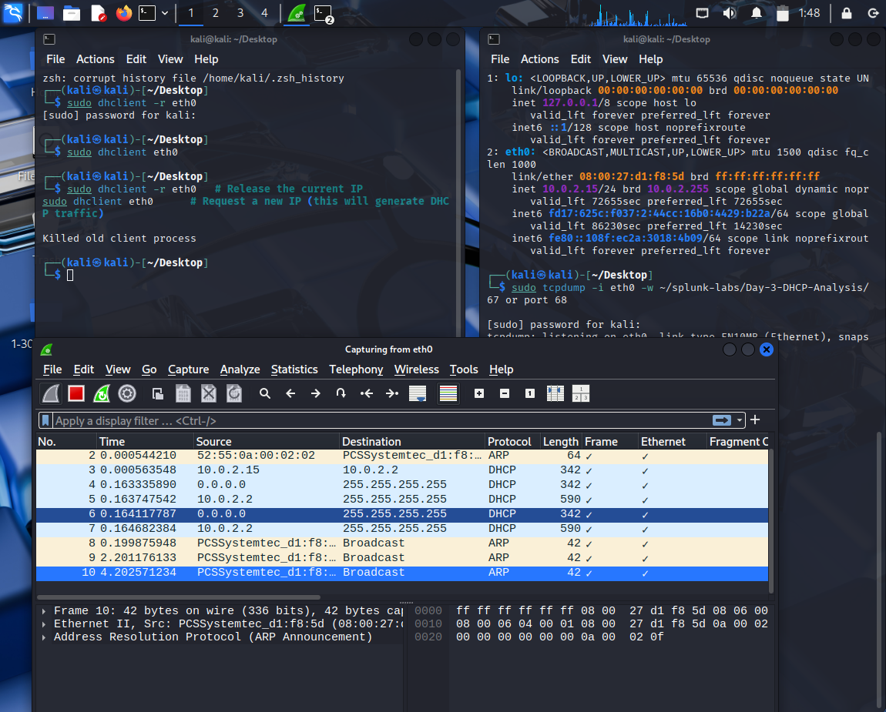
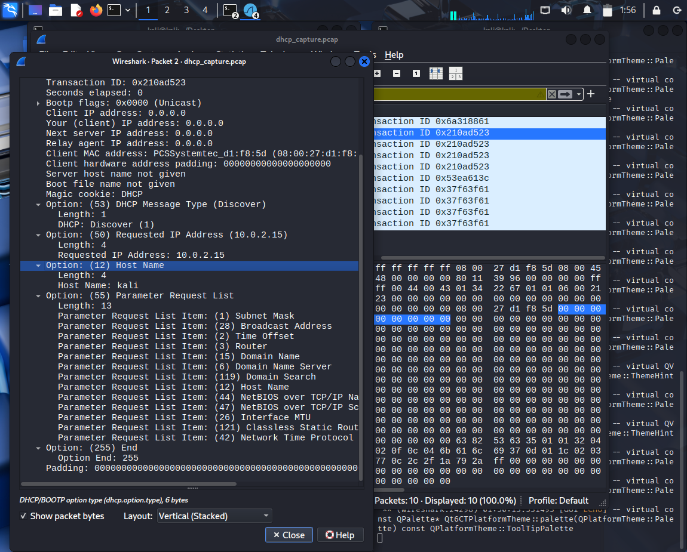
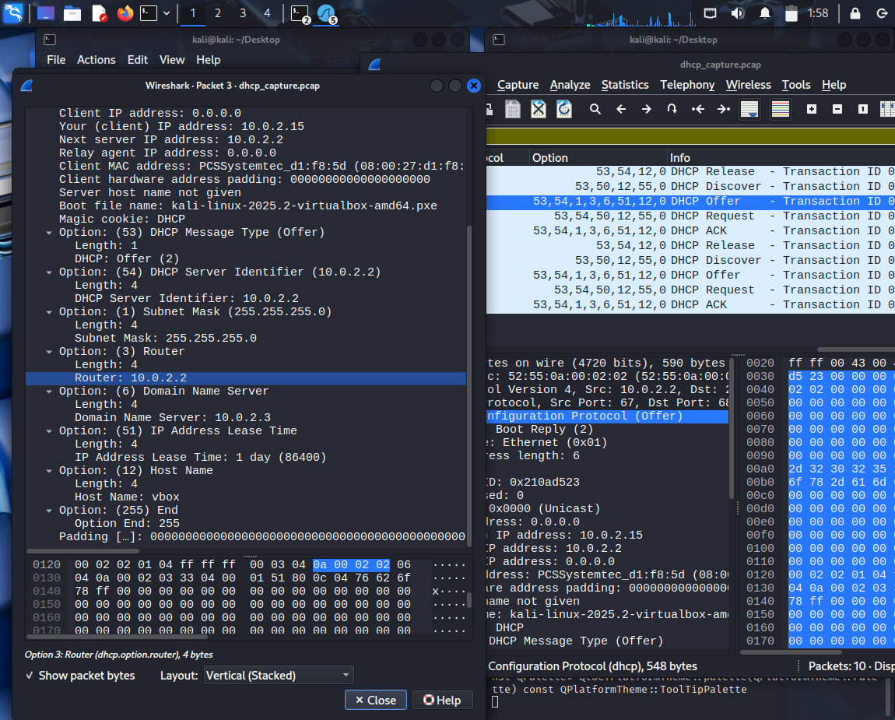
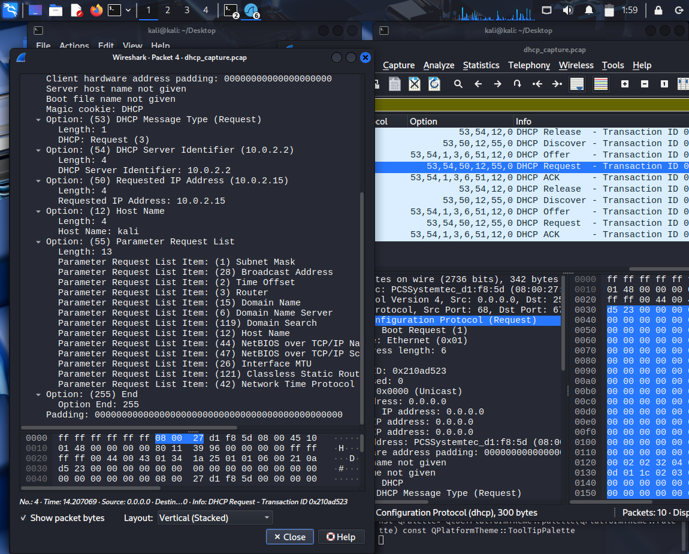
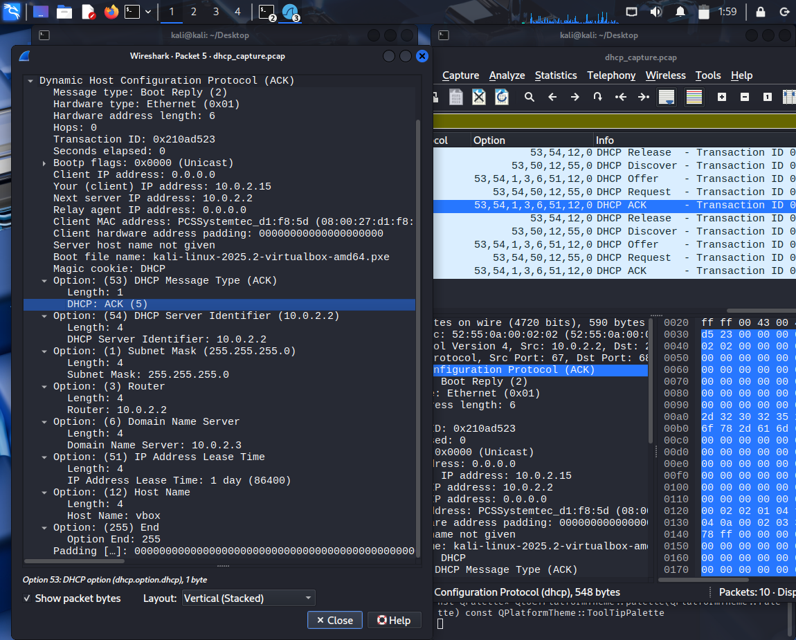
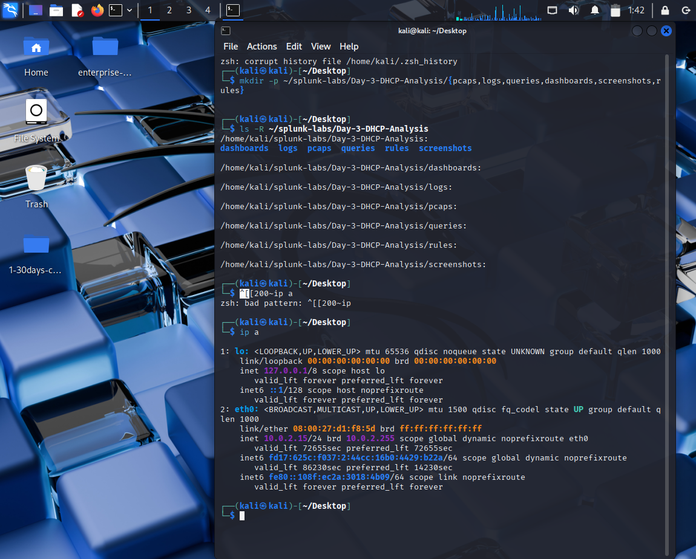

# Day-3: DHCP Threat Analysis Lab (Expert Level)

## 📌 Overview
This lab captures and analyzes **real DHCP traffic** in Kali Linux.  
We explored the DHCP handshake (Discover → Offer → Request → Ack), inspected critical options, and discussed how DHCP can be exploited by attackers.  
Both raw and Wireshark-analyzed packet captures are included.

---

## 📂 Project Structure
Day-3-DHCP-Analysis/
├── pcaps/ # Captured DHCP traffic (.pcap / .pcapng)
├── screenshots/ # Packet analysis evidence
├── logs/ # Tool outputs
├── queries/ # Wireshark/Splunk filters
├── dashboards/ # Future Splunk dashboards
├── rules/ # IDS/IPS rules
└── README.md # Documentation

---

## 🔎 DHCP Handshake Analysis

### DHCP Overview
  
All DHCP packets captured (Release, Discover, Offer, Request, Ack).

---

### 1. DHCP Discover
  
- Transaction ID: `0x210ad523`  
- Requested IP: `10.0.2.15`  
- Hostname: `kali`  
- Parameter Request List: Subnet Mask, Router, DNS, etc.  

---

### 2. DHCP Offer
  
- Server Identifier: `10.0.2.2`  
- Offered IP: `10.0.2.15`  
- Lease Time: X seconds  

---

### 3. DHCP Request
  
- Client requests offered IP `10.0.2.15`  
- Transaction ID matches Discover/Offer  

---

### 4. DHCP Ack
  
- Server confirms lease of `10.0.2.15`  
- Includes Router and DNS info  

---

## 🌐 Finding Network Info
  
Additional evidence showing client/server IP mappings.

---

## 🚨 Security Perspective
- **Rogue DHCP Server:** Attacker injects fake gateway/DNS.  
- **DHCP Starvation:** Flood of Discover messages exhausts server IP pool.  
- **Detection Ideas:**  
  - Monitor for multiple Offers (sign of rogue server).  
  - Flag abnormal lease times.  
  - Watch for repeated Discover storms.

### Example Snort Rule
```snort
alert udp any 67 -> any 68 (msg:"DHCP Rogue Server Detected"; content:"53 02"; offset:240; depth:1; sid:100001; rev:1;)

🛠️ Tools Used

tcpdump → Capture DHCP traffic

Wireshark → Protocol analysis

dhclient → Trigger Discover/Request cycle

Kali Linux → Lab environment

✅ Conclusion

This lab demonstrates a real-world DHCP handshake capture and analysis, along with insights into how DHCP can be abused in enterprise environments.
Future expansion: simulate a rogue DHCP server and detect it with Snort/Splunk.
