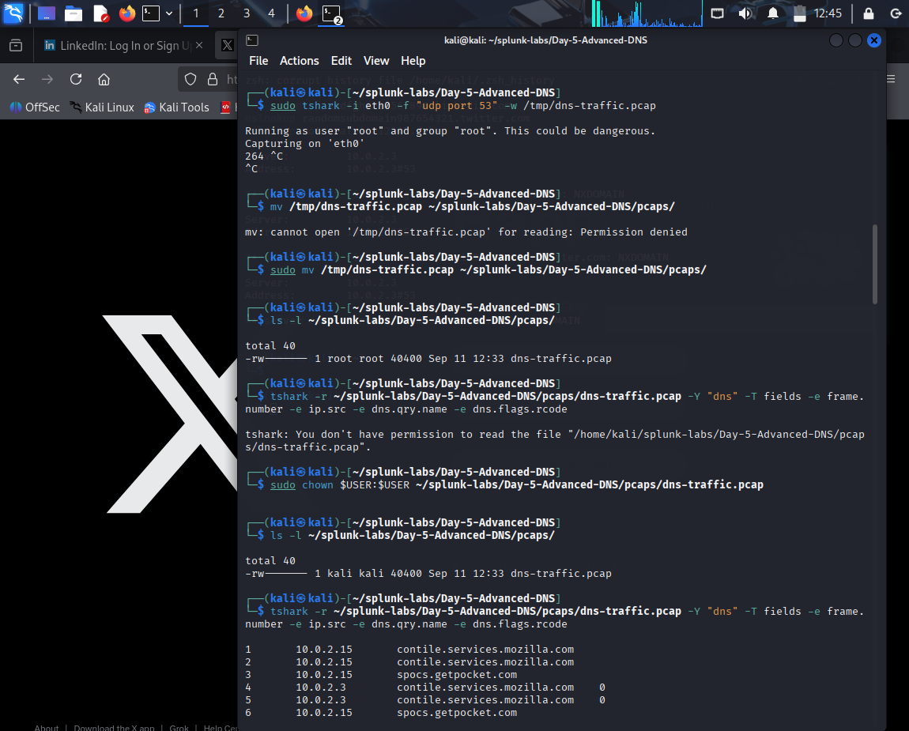
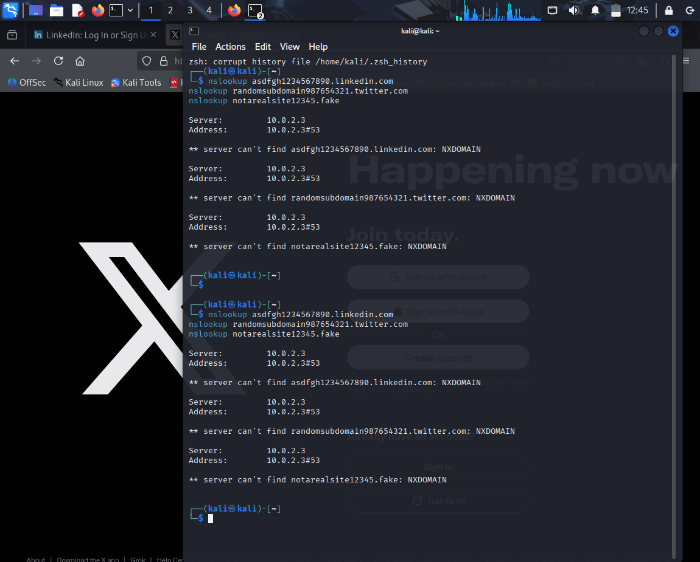
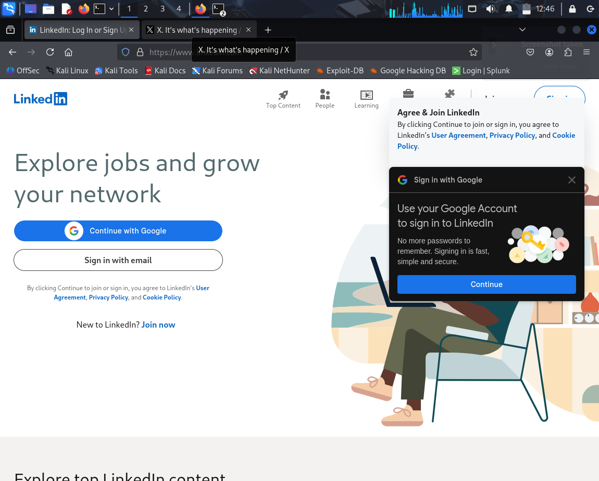
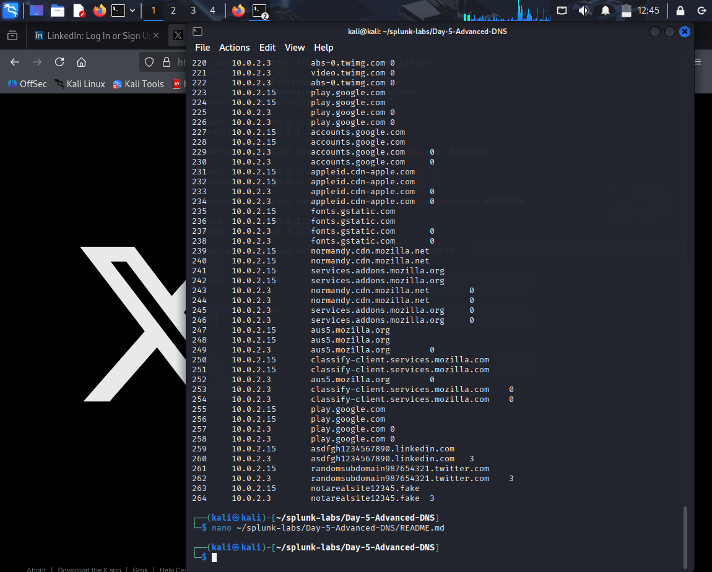

# Day 5 — Advanced DNS Analysis 🌿

## 🎯 Objective
Capture DNS traffic using **tshark**, analyze normal vs suspicious queries, and identify anomalies such as **NXDOMAIN responses** that could indicate tunneling or exfiltration attempts.

---

## 🛠️ Steps Performed

1. **Capture DNS traffic**
   ```bash
   sudo tshark -i eth0 -f "udp port 53" -w /tmp/dns-traffic.pcap
   sudo mv /tmp/dns-traffic.pcap ~/splunk-labs/Day-5-Advanced-DNS/pcaps/
2 Normal Queries

  Browsed social media domains:

  linkedin.com

  twitter.com

  x.com

  Observed successful responses (rcode 0).

3. Suspicious Queries

#nslookup asdfgh1234567890.linkedin.com
#nslookup randomsubdomain987654321.twitter.com
#nslookup notarealsite12345.fake


 All returned rcode 3 (NXDOMAIN).

 Pattern: long/random subdomains and non-existent TLDs.

4.Analysis

#tshark -r pcaps/dns-traffic.pcap -Y "dns" -T fields -e frame.number -e ip.src -e dns.qry.name -e dns.flags.rcode


 Normal queries: rcode 0

 Suspicious queries: rcode 3 (NXDOMAIN)

# 📊 Findings

# ✅ Normal Behavior: Recognizable domains (LinkedIn, Twitter) resolved properly.

# Suspicious Indicators:
#Repeated NXDOMAIN (ponf.linkedin.com, fake subdomains).

#Long/random query strings typical of tunneling/exfiltration.
## 📸 Screenshots

### 1. Tshark capturing DNS traffic


### 2. Normal vs Suspicious Queries


### 3. Multiple Terminals Running


### 4. Additional Traffic Captured


#📂 Folder Structure
#Day-5-Advanced-DNS/
 ├── pcaps/ (dns-traffic.pcap)
 ├── logs/ (nslookup & dig commands)
 ├── screenshots/ (Wireshark/tshark outputs)
 └── README.md
---

## 🔑 Key Takeaway

This lab is unique because it introduces **tshark (command-line Wireshark)** for the first time in my 30-day challenge.  
Unlike earlier labs that focused on GUI-based Wireshark, here we explored **terminal-based packet capture and analysis**.  
This makes the lab more automation-friendly and useful for scripting or SOC environments.


