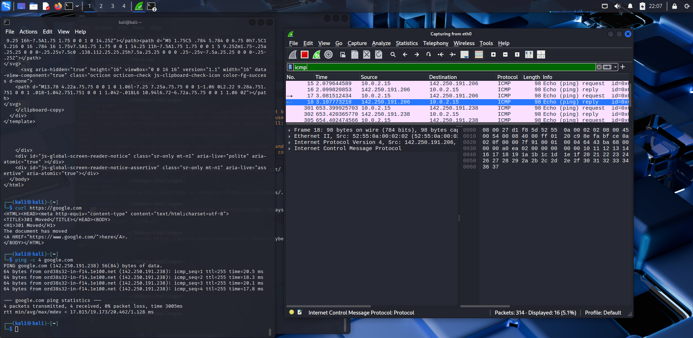
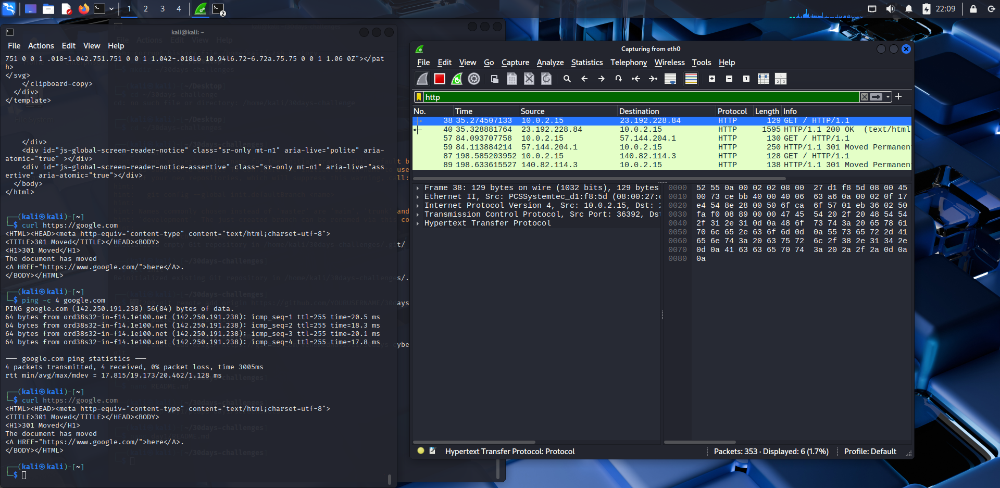

# Day 1 – OSI/TCP-IP Review

## 🎯 Objective
Review OSI & TCP/IP models and capture real-world traffic in Wireshark.

## 🛠️ Tools Used
- **Wireshark** (packet capture & analysis)
- **Kali Linux** terminal commands:
  - `ping -c 4 google.com`
  - `curl http://example.com`
  - `dig google.com`

## 🧪 Lab Steps
1. Started Wireshark on interface `eth0`.
2. Sent 4 ICMP echo requests to Google:
   ```bash
   ping -c 4 google.com
→ Captured ICMP request/reply packets.
->Sent HTTP GET request:
   ->curl http://example.com
→ Captured TCP 3-way handshake and HTTP/200 OK response.
->sent DNS query
   ->dig google.com
→ Captured DNS A/AAAA record responses.

🔍 Findings

DNS (UDP, Application Layer): Resolved google.com and example.com.

ARP (Data Link Layer): Local devices exchanged MAC addresses before IP traffic.

ICMP (Network Layer): Echo request/reply confirmed connectivity.

HTTP (Application Layer): Captured GET request, 200 OK response.

TCP (Transport Layer): Saw SYN → SYN/ACK → ACK (handshake).

# day1/screenshots/

## 📸 Screenshots

- 
- 
- 

